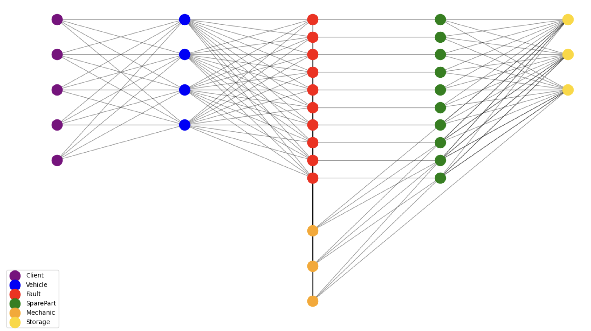
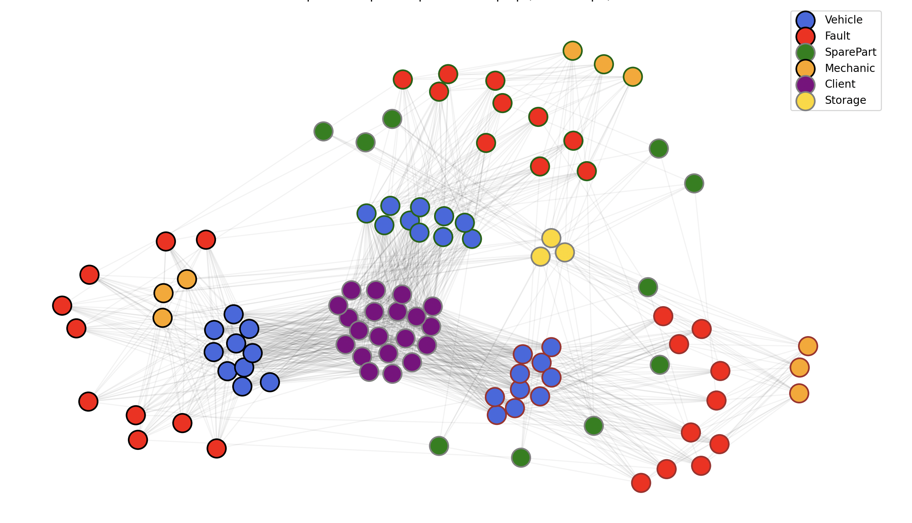
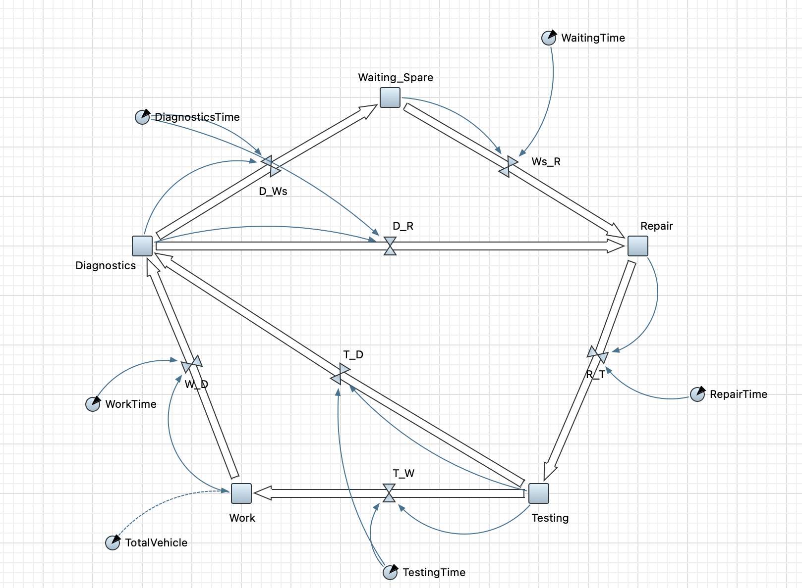
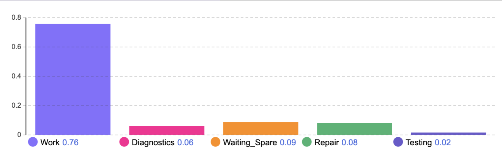
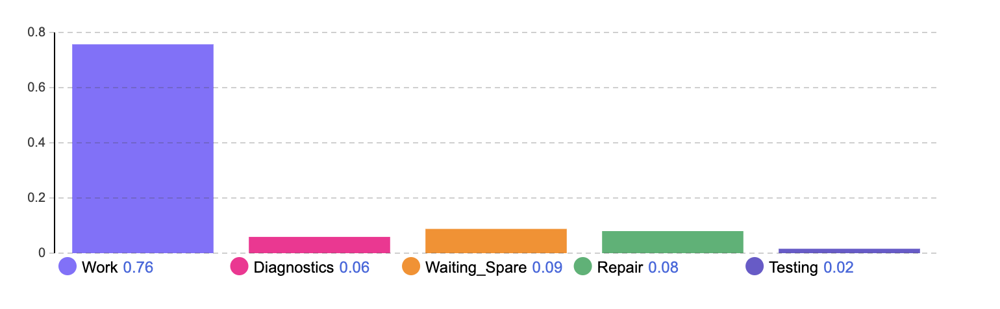
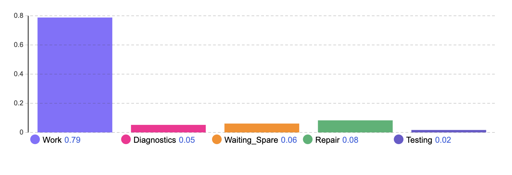
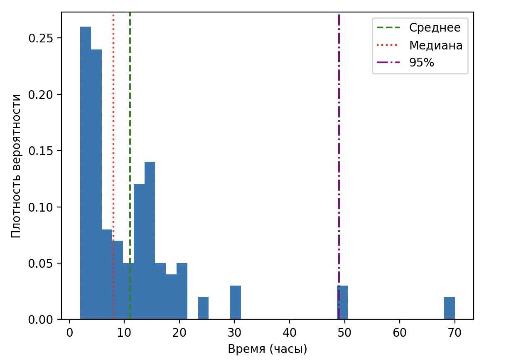
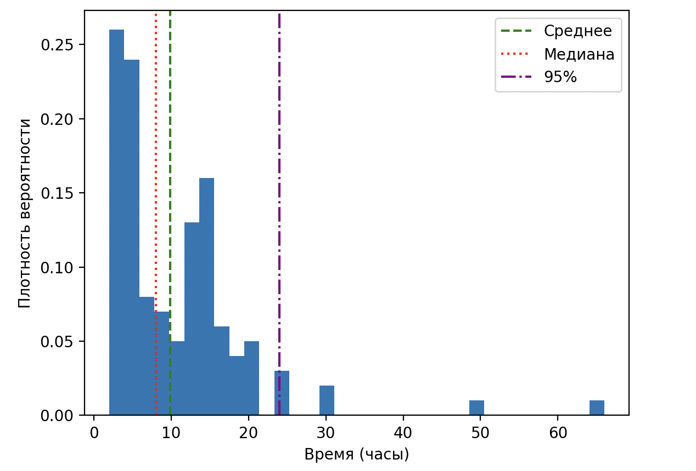

# Моделирование и оптимизация сервисной сети на основе графовых и марковских моделей

**Цель работы:** Разработать графовую модель системы сервисного обслуживания транспортных средств службы доставки, позволяющую проводить комплексный анализ структуры, выявлять узкие места и оценивать эффективность различных стратегий обслуживания и ремонта.

**Стек:** Python, NetworkX, AnyLogic

---

## 1. Анализ предметной области

Рассматривается служба доставки с парком ~10 000 транспортных средств и 3 крупными распределительными складами. Простои транспортных средств из-за поломок ведут к прямым убыткам (штрафы за срыв доставки, стоимость ремонта) и косвенным (потеря репутации, упущенная выгода). Задача — оптимизация сервисной сети, обеспечивающей быстрое и экономически эффективное восстановление работоспособности ТС.

### Ключевые сущности системы

- **Vehicle** — транспортные средства, подверженные поломкам
- **Fault** — неисправности, классифицированные по типу и критичности
- **SparePart** — запасные части, необходимые для ремонта
- **Mechanic** — сервисный персонал трёх классов квалификации
- **Client** — заказчики доставки с SLA-требованиями
- **Storage** — сервисные центры и склады ЗИП

### Входные параметры модели

Таблица 1. Типы неисправностей

| № | Вид неисправности | Вер-ть | Время д-ки, ч | Время ремонта, ч | Уровень сложности |
|---|---|---|---|---|---|
| 1 | Поломка двигателя | 0.01 | 6 | 60 | 3 |
| 2 | Поломка коробки передач | 0.03 | 4 | 40 | 3 |
| 3 | Повреждение кузова | 0.05 | 1 | 30 | 3 |
| 4 | Треснуло стекло | 0.08 | 1 | 4 | 2 |
| 5 | Спустило колесо | 0.20 | 0.5 | 1 | 1 |
| 6 | Перегорела лампочка | 0.15 | 0.5 | 1 | 1 |
| 7 | Проблема с тормозами | 0.12 | 1 | 3 | 1 |
| 8 | Поломка подвески | 0.10 | 2 | 10 | 2 |
| 9 | Разрядился аккумулятор | 0.12 | 1 | 1 | 1 |
| 10 | Проблемы с подачей топлива | 0.14 | 3 | 6 | 2 |

Таблица 2. Классы механиков

| Класс | Время ожидания, ч | Стоимость работы, р/ч |
|---|---|---|
| 1 | 0 | 300 |
| 2 | 4 | 700 |
| 3 | 12 | 1200 |

Таблица 3. Логистика складов

| Склад | Время доставки, дни |
|---|---|
| Локальный склад сервиса | 0 |
| Центральный региональный склад | 0.5 |
| Другой город | 3 |

---

## 2. Графовая модель

### Структура графа

Построен ориентированный взвешенный мультиграф G=(V,E,w):

- **Ориентированный:** направление рёбер соответствует причинно-следственным связям (ТС → поломка → запчасть/механик → склад)
- **Взвешенный:** каждому ребру приписан вес — вероятность поломки, время ремонта, время доставки
- **Мультиграф:** между двумя вершинами может существовать несколько рёбер разного типа

**Метрики графа:**
- Вершин: **1 379**
- Рёбер: **2 267**



### Кластеризация

Для выявления региональных подсистем проведена кластеризация с использованием алгоритма Лейдена. Каждый кластер объединяет распределительные центры, привязанные к ним автомобили, типовые поломки, закреплённых инженеров и склады — и может рассматриваться как относительно автономный участок сервисной сети.



---

## 3. Марковская модель

### Состояния системы

Жизненный цикл транспортного средства описывается пятью состояниями:

1. **Work (W)** — штатная эксплуатация
2. **Diagnostics (D)** — диагностика неисправности
3. **Waiting_Spare (WS)** — ожидание запасных частей
4. **Repair (R)** — выполнение ремонта
5. **Testing (T)** — контрольная проверка

### Матрица переходных вероятностей

```
     W     D     WS    R     T
W  [0.00, 1.00, 0.00, 0.00, 0.00]
D  [0.00, 0.00, 0.53, 0.47, 0.00]
WS [0.00, 0.00, 0.20, 0.80, 0.00]
R  [0.00, 0.00, 0.00, 0.10, 0.90]
T  [0.90, 0.10, 0.00, 0.00, 0.00]
```

### Динамический пересчёт вероятностей

В отличие от классических марковских моделей, вероятности переходов не являются фиксированными — они вычисляются динамически в зависимости от состояния графа: текущего уровня запасов, загруженности механиков и критичности неисправности.

Пример расчёта вероятности перехода Diagnostics → Waiting_Spare:

$$p_{D \rightarrow WS} = (1 - A) \cdot U \cdot E$$

где $A$ — доступность запасной части, $U$ — коэффициент срочности, $E$ — приоритет ТС.

---

## 4. Реализация интеграции моделей

Марковская модель реализована в AnyLogic в виде диаграммы состояний. Графовая модель используется как внешний расчётный модуль, обеспечивающий динамический пересчёт параметров марковского процесса.



Средние времена переходов рассчитываются на основе характеристик неисправности, логистики и загрузки персонала:

$$T_{D \rightarrow R} = T_{diag} + T_{repair} \cdot K_{load}$$
$$T_{D \rightarrow WS} = T_{diag} + T_{delivery}$$

```python
if spare_part.stock > 0:
    transition_time = diagnosis_time + repair_time
else:
    transition_time = diagnosis_time + delivery_time
```

---

## 5. Анализ модели

### Критические элементы системы

Анализ выявил три ключевых узких места:

- **Механики 3 класса** — наиболее критичный ресурс: способны устранять сложные неисправности, но их ограниченное количество приводит к значительным очередям
- **Неисправности топливной системы** — наибольший вклад в простой: высокая вероятность (0.14) + большое время ремонта (6 ч) + запчасти из другого города (3 дня)
- **Удалённые склады** — запчасти из другого города формируют логистические узкие места с временем доставки до 3 дней

### Распределение времени по состояниям (до оптимизации)



---

## 6. Оптимизация

Рассмотрены два сценария оптимизации: увеличение доступности механиков 3 класса и перенос наиболее востребованных запчастей на региональный склад.

| Показатель | До | После |
|---|---|---|
| Среднее время ожидания мастера 3 класса | 12 ч | 6 ч |
| Среднее время ожидания деталей (топливная система) | 3 дня | 0.5 дня |
| Среднее время в состоянии Diagnostics | 3.7 ч | 3.1 ч |
| Среднее время в состоянии Waiting_Spare | 8.32 ч | 5.5 ч |

**Время диагностики сократилось на 14%**

**Время ожидания деталей сократилось на 34%**

**Доля работающих машин выросла на 3%**

До оптимизации:



После оптимизации:



Среднее и медианное время практически не изменилось, но 95-й процентиль сократился с 48 до 24 часов — вероятность критически долгого ремонта снизилась вдвое.

Распределение времени восстановления до оптимизации:



Распределение времени восстановления после оптимизации:



---

## Приложение. Код расчёта переходных времён

```python
from dataclasses import dataclass
from typing import Dict

@dataclass
class Mechanic:
    level: int
    workload: float
    base_efficiency: float

    def waiting_time(self) -> float:
        return self.workload * (1 / self.base_efficiency)

@dataclass
class SparePart:
    name: str
    stock: int
    delivery_time: float

    def waiting_time(self) -> float:
        return 0 if self.stock > 0 else self.delivery_time

@dataclass
class Fault:
    name: str
    diagnosis_time: float
    repair_time: float
    criticality: float

@dataclass
class Vehicle:
    priority: float

class ServiceGraph:
    def __init__(self):
        self.mechanics: Dict[str, Mechanic] = {}
        self.spare_parts: Dict[str, SparePart] = {}
        self.faults: Dict[str, Fault] = {}
        self.vehicles: Dict[str, Vehicle] = {}

class TransitionTimeCalculator:
    def __init__(self, graph: ServiceGraph):
        self.graph = graph

    def diagnostics_to_repair(self) -> float:
        fault = self.graph.faults["fuel_fault"]
        mechanic = self.graph.mechanics["mechanic_lvl3"]
        return round(fault.diagnosis_time + mechanic.waiting_time() * fault.criticality, 1)

    def diagnostics_to_waiting_spare(self) -> float:
        fault = self.graph.faults["fuel_fault"]
        spare = self.graph.spare_parts["fuel_pump"]
        return round(fault.diagnosis_time + spare.waiting_time() * 0.1, 1)

    def waiting_spare_to_repair(self) -> float:
        fault = self.graph.faults["fuel_fault"]
        spare = self.graph.spare_parts["fuel_pump"]
        return round(spare.waiting_time() * 0.5 + fault.repair_time, 1)

    def calculate_all(self) -> Dict[str, float]:
        return {
            "Diagnostics_to_Repair": self.diagnostics_to_repair(),
            "Diagnostics_to_WaitingSpare": self.diagnostics_to_waiting_spare(),
            "WaitingSpare_to_Repair": self.waiting_spare_to_repair(),
            "Repair_to_Testing": 1.0
        }
```
