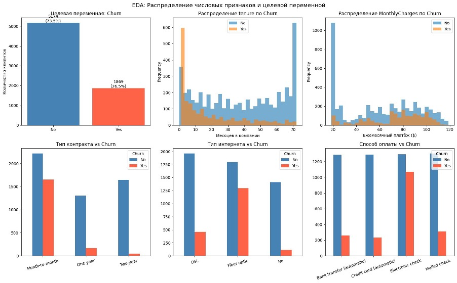
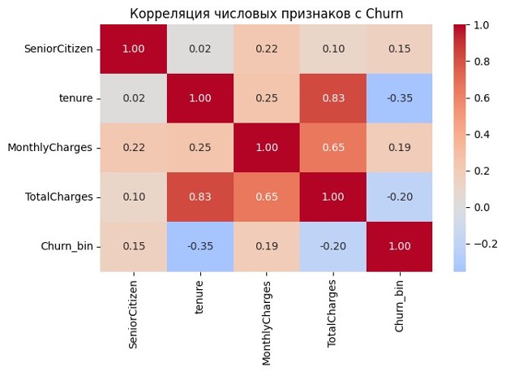
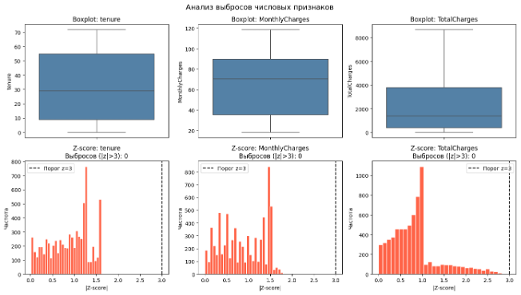
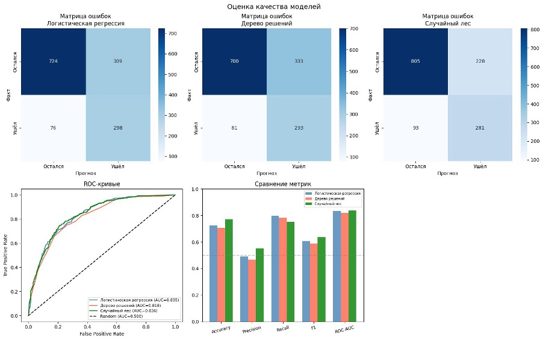
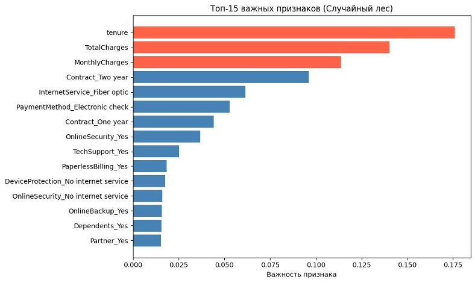

# Методы машинного обучения в решении бизнес-задач

Цель работы — применить методы машинного обучения для решения задачи бинарной классификации: построить модель, предсказывающую отток клиентов телекоммуникационной компании на основе демографических данных, истории потребления услуг, типа контракта и способа оплаты.

---

## Данные

**Датасет:** [Telco Customer Churn — Kaggle / IBM Sample Data](https://www.kaggle.com/datasets/blastchar/telco-customer-churn)

| Характеристика | Значение |
|---|---|
| Количество наблюдений | 7 043 (после очистки: 7 032) |
| Количество признаков | 20 (без customerID) |
| Тип задачи | Бинарная классификация |
| Целевая переменная | Churn (1 — клиент ушёл, 0 — остался) |
| Доля целевого класса | 26.5% (ушёл) / 73.5% (остался) |
| Категориальных / числовых признаков | 15 / 3 |
| Пропуски | TotalCharges: 11 скрытых пропусков (пробелы при tenure=0) |

---

## Исследовательский анализ данных (EDA)

Датасет загружен в pandas DataFrame. Выполнен первичный осмотр: проверены типы данных, пропуски, распределения числовых и категориальных признаков. Обнаружено, что колонка `TotalCharges` имеет тип `object` вместо числового — причиной оказались скрытые пробелы в 11 строках с `tenure=0`. Дисбаланс классов составляет 73.5% / 26.5%.

На графиках отчётливо видны несколько закономерностей. Уходящие клиенты сконцентрированы в первые 1–10 месяцев обслуживания, тогда как лояльные клиенты распределены равномерно с пиком на 70+ месяцах. Клиенты с более высоким ежемесячным платежом (от 60$) уходят значительно чаще. Помесячный контракт демонстрирует непропорционально высокий отток по сравнению с годовыми и двухлетними. Клиенты с подключением Fiber optic уходят заметно чаще, чем пользователи DSL.

Тепловая карта показывает, что `tenure` имеет отрицательную корреляцию с Churn (−0.35): чем дольше клиент пользуется услугами, тем ниже вероятность оттока. `MonthlyCharges` положительно коррелирует с оттоком (+0.19). Обнаружена сильная мультиколлинеарность между `tenure` и `TotalCharges` (r=0.83).

---

## Предобработка данных

Колонка `customerID` удалена как идентификатор без аналитической ценности. `TotalCharges` конвертирована в числовой тип; 11 строк с пустыми значениями удалены — их доля менее 0.2%. Целевая переменная `Churn` закодирована в бинарный формат (Yes→1, No→0).

Для категориальных признаков применён One-Hot Encoding (`pd.get_dummies`, `drop_first=True`) — 15 категориальных колонок преобразованы в 26 бинарных. Данные разделены на обучающую (80%) и тестовую (20%) выборки с параметром `stratify=y`. Для логистической регрессии применён `StandardScaler`, причём `fit` выполнен исключительно на обучающей выборке во избежание утечки данных. Дисбаланс классов устранён через `class_weight='balanced'`.

| Шаг | Действие | Обоснование |
|---|---|---|
| Обработка пропусков | `df.dropna(subset=['TotalCharges'])` | 11 строк с tenure=0; доля < 0.2% |
| Кодирование категорий | `pd.get_dummies(drop_first=True)` | Устраняет мультиколлинеарность |
| Масштабирование | `StandardScaler`, fit только на train | Необходимо для логистической регрессии |
| Разделение выборок | `train_test_split(test_size=0.2, stratify=y)` | Сохраняет пропорции классов |
| Балансировка | `class_weight='balanced'` | Корректирует веса без изменения выборки |

Визуализация выбросов выполнена двумя методами: boxplot и z-score. Ни один из методов не выявил выбросов — все признаки имеют естественные границы, обусловленные тарифной сеткой.

---

## Построение и обучение моделей

Обучены три модели классификации из библиотеки `scikit-learn`:

- **Логистическая регрессия** — `max_iter=1000`, `class_weight='balanced'`, обучалась на масштабированных данных
- **Дерево решений** — `max_depth=5`, `class_weight='balanced'`
- **Случайный лес** — `n_estimators=100`, `max_depth=10`, `class_weight='balanced'`

Все модели обучены на одной обучающей выборке (5 625 наблюдений) и оценены на тестовой (1 407 наблюдений).

Для лучшей модели выполнен подбор гиперпараметров через `GridSearchCV` (5-fold кросс-валидация, оптимизация по F1). Перебрано 12 комбинаций параметров: `n_estimators` ∈ {100, 200}, `max_depth` ∈ {5, 10, 15}, `min_samples_split` ∈ {2, 5}. Лучшая комбинация совпала с исходной, что подтверждает корректность ручного выбора параметров.

---

## Оценка качества моделей

| Модель | Accuracy | Precision | Recall | F1 | ROC-AUC |
|---|---|---|---|---|---|
| Логистическая регрессия | 0.726 | 0.491 | 0.797 | 0.608 | 0.835 |
| Дерево решений | 0.706 | 0.468 | 0.783 | 0.586 | 0.818 |
| **Случайный лес** | **0.772** | **0.552** | **0.751** | **0.636** | **0.836** |

Лучшей моделью выбран случайный лес: наивысший F1-score (0.636) и Accuracy (0.772) при конкурентном ROC-AUC (0.836). Хотя логистическая регрессия имеет более высокий Recall (0.797 против 0.751), она значительно проигрывает по Precision (0.491 против 0.552), что означает существенно больше ложных срабатываний.

---

## Важность признаков

Проанализирована важность признаков модели случайный лес через атрибут `feature_importances_`. Три наиболее важных признака — `tenure` (0.176), `TotalCharges` (0.140) и `MonthlyCharges` (0.114) — все связаны с финансовым профилем и сроком обслуживания клиента. Далее следуют тип контракта (`Contract_Two year` — 0.096), тип интернет-соединения (`InternetService_Fiber optic` — 0.061) и способ оплаты (`PaymentMethod_Electronic check` — 0.053).

