# Прогнозирование продаж с сезонной компонентой в Excel

Цель работы — освоить методы анализа временных рядов с сезонной компонентой: научиться выявлять и выделять сезонность, строить прогнозные модели с использованием метода Хольта-Винтерса и оценивать их точность для поддержки бизнес-планирования.

---

## Данные

Датасет взят с Kaggle: [Comprehensive Dataset for Retail Data Analysis](https://www.kaggle.com/datasets/shelendata/comprehensive-dataset-for-retail-data-analysis).

Набор содержит данные о продажах обуви в розничной сети. Период: январь 2022 — декабрь 2024, 447 наблюдений с ежемесячной частотой. Пропусков и аномальных значений в данных нет. Исходный датасет включал Excel-файл и два CSV-файла.

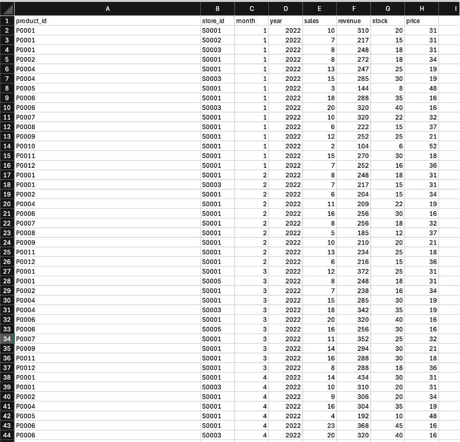

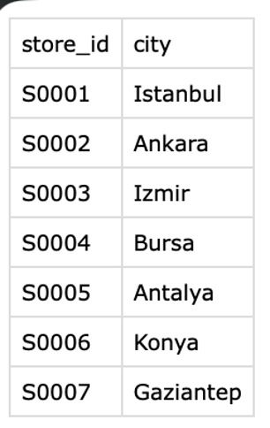

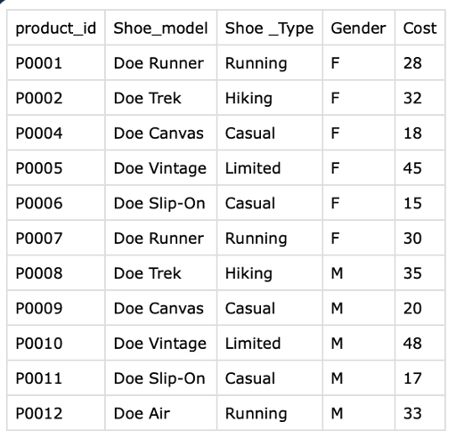

---

## Подготовка данных

Исходный датасет состоял из нескольких файлов. Объединил их в одну таблицу с помощью Power Query.

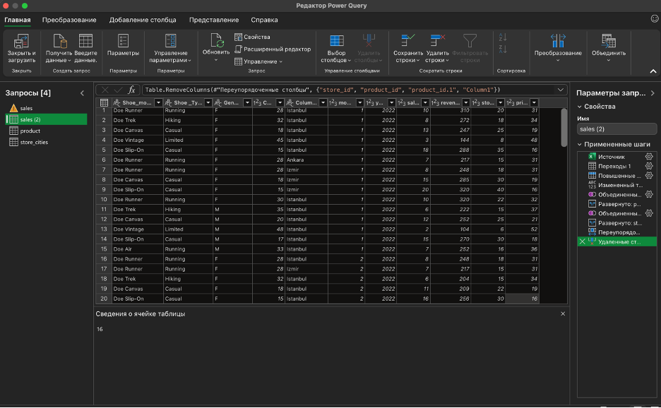

После объединения получилась плоская таблица, готовая к работе.

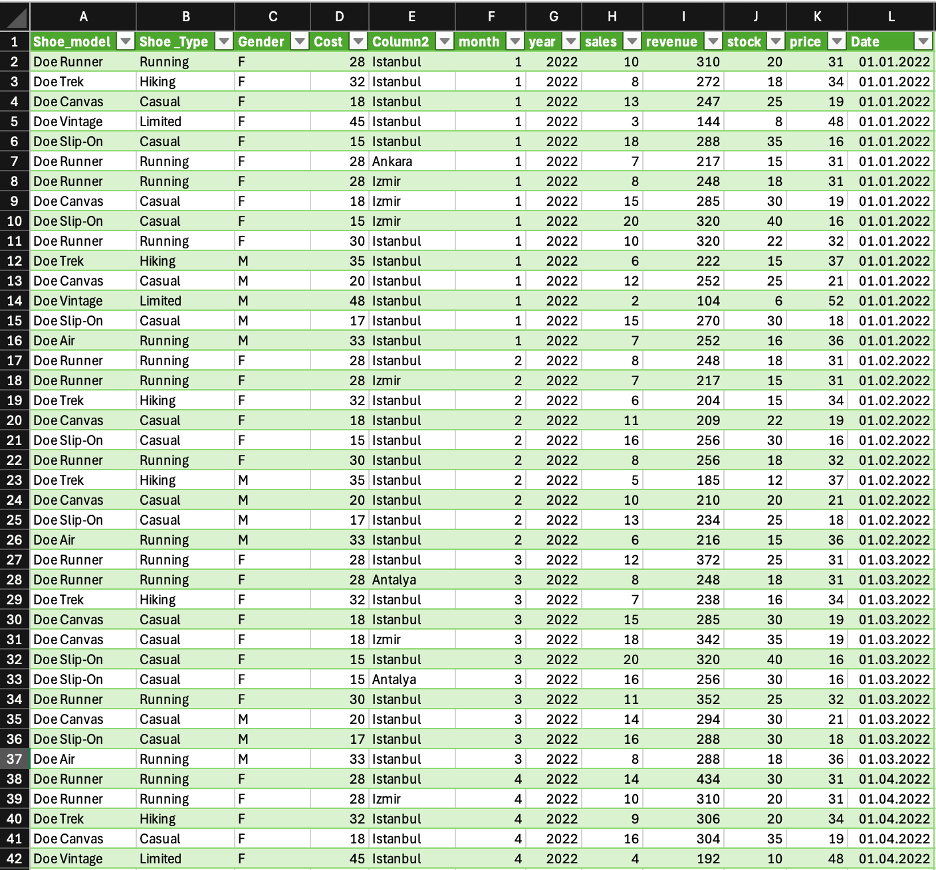

Отфильтровал данные по модели Convas с помощью срезов — на графике продаж по этой модели отчётливо видна выраженная сезонность с пиками в летние месяцы.

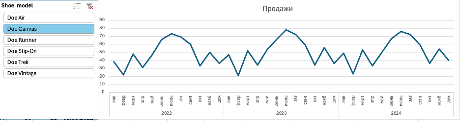

---

## Расчёт коэффициентов сезонности

Коэффициенты сезонности рассчитал двумя способами и сравнил результаты.

Первый способ — через средние значения: для каждого месяца вычислил среднее за все три года, затем разделил на общее среднее по всем периодам.

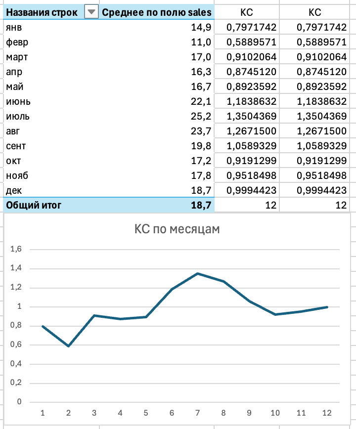

Второй способ — через сводную таблицу: агрегировал продажи по месяцам и годам, после чего рассчитал коэффициенты аналогичным образом.

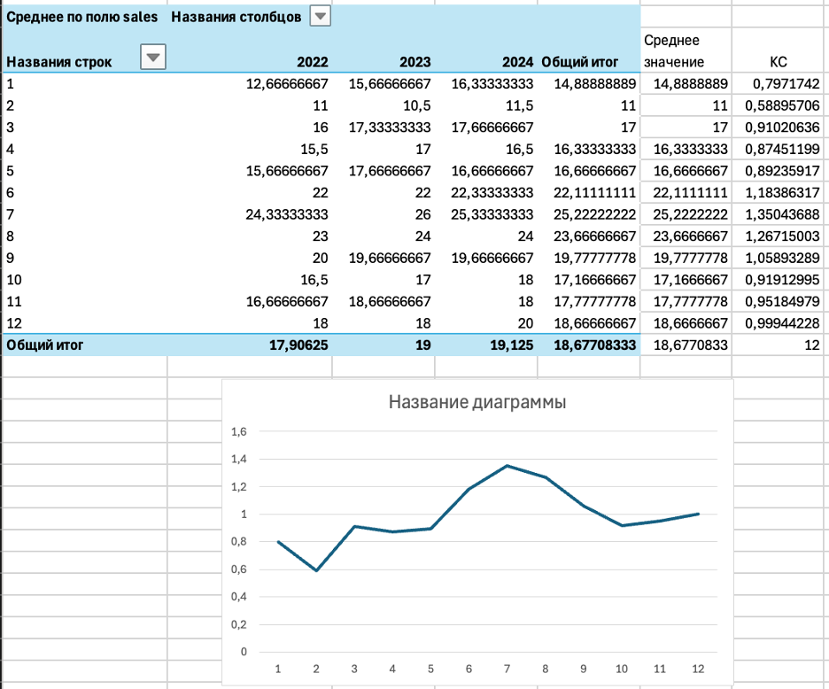

Результаты двух методов совпали до десятитысячных долей. Наибольшие коэффициенты — у июля (1.35) и августа (1.27), наименьший — у февраля (0.59).

---

## Модель Хольта-Винтерса

Реализовал мультипликативную модель Хольта-Винтерса вручную через формулы Excel. Модель использует три уравнения:

- сглаженный уровень: `Lt = k × (Yt / St-s) + (1 - k) × (Lt-1 + Tt-1)`
- тренд: `Tt = b × (Lt - Lt-1) + (1 - b) × Tt-1`
- сезонность: `St = q × (Yt / Lt) + (1 - q) × St-s`
- прогноз: `Ŷt = (Lt-1 + Tt-1) × St-s`

Три коэффициента сглаживания k, b, q подобрал с помощью надстройки Excel "Поиск решения". В качестве целевой ячейки задал MAPE по всей исторической выборке — минимизировал её. Изменяемые ячейки — k, b, q, для каждого задал ограничение: значение от 0 до 1. После оптимизации коэффициенты были автоматически подобраны так, чтобы модель максимально точно воспроизводила исторические данные.

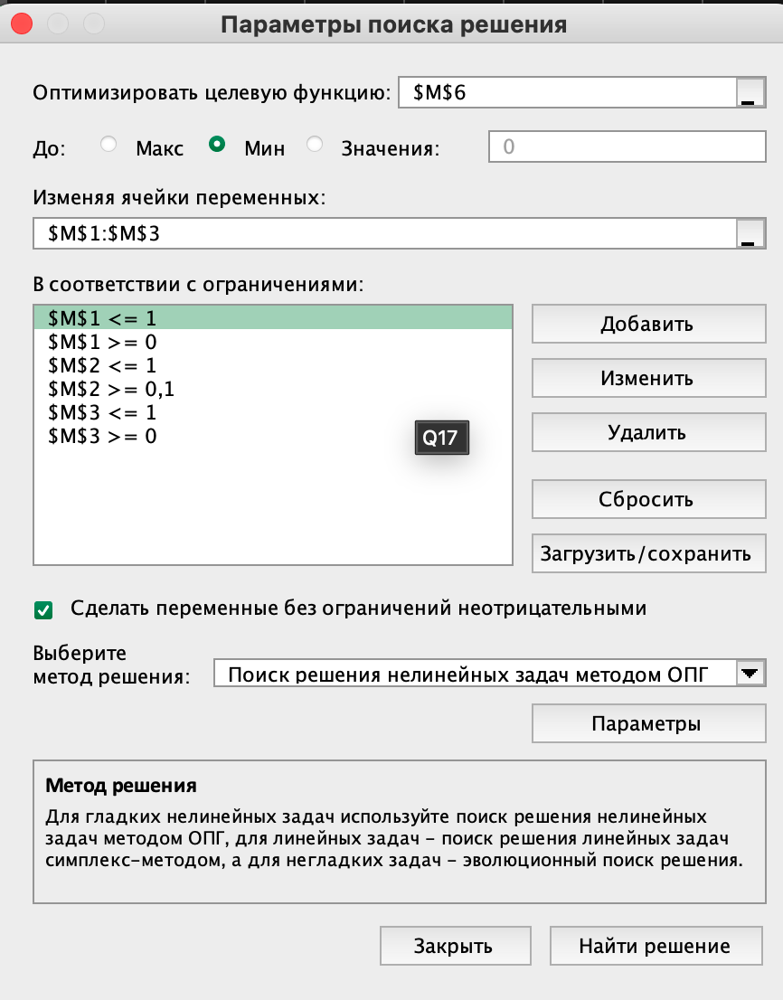

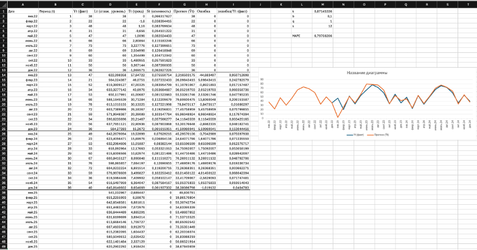

---

## Оценка модели

Рассчитал метрики MSE и MAPE для оценки качества модели. Итоговая MAPE по всей исторической выборке составила 6.3% — это высокая точность прогноза. На графике сравнения хорошо видно совпадение исторических и прогнозных значений на всём периоде.

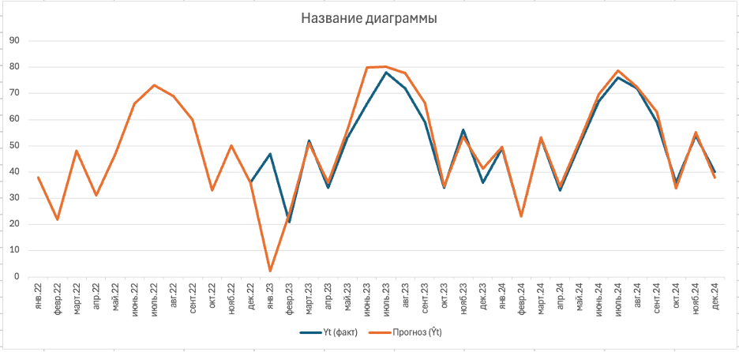

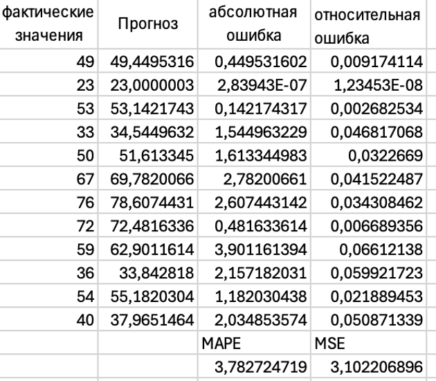

---

## Прогноз на 2026 год

На основе построенной модели сформировал прогноз продаж на все 12 месяцев 2026 года. Прогноз воспроизводит сезонный паттерн: пик приходится на июль (81 ед.) и август (75 ед.), минимум — на февраль (19 ед.).

| Месяц | Прогноз |
|---|---|
| Январь | 54 |
| Февраль | 19 |
| Март | 50 |
| Апрель | 33 |
| Май | 53 |
| Июнь | 71 |
| Июль | 81 |
| Август | 75 |
| Сентябрь | 62 |
| Октябрь | 36 |
| Ноябрь | 52 |
| Декабрь | 38 |
