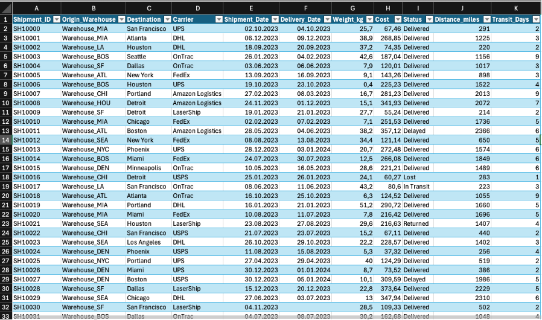
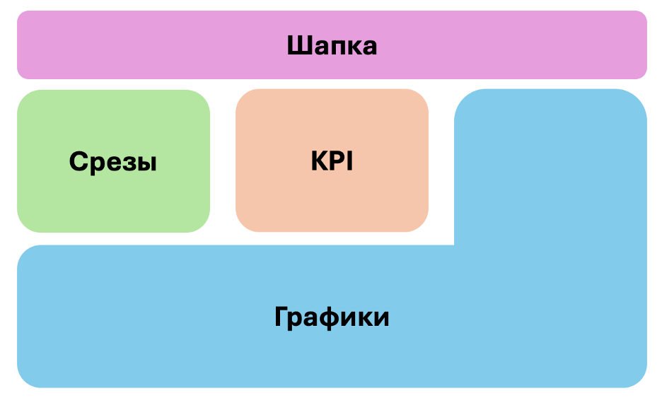
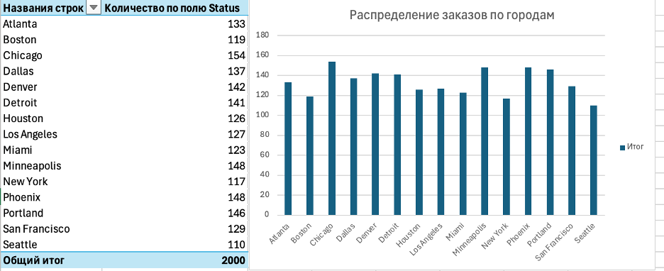
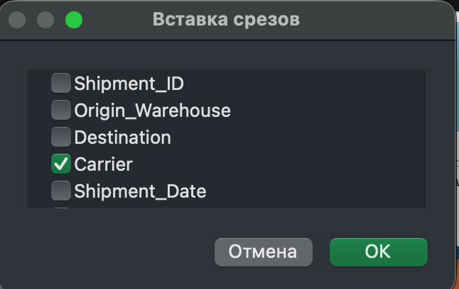
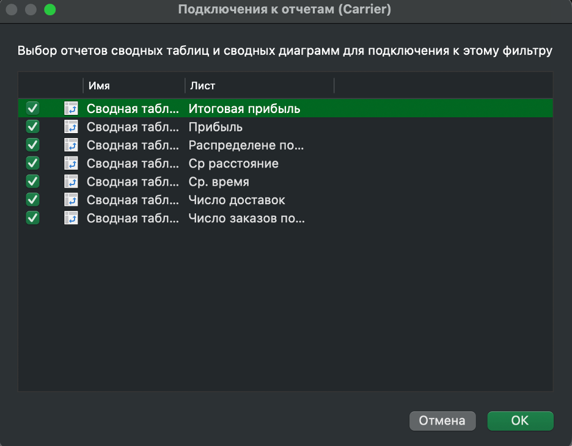
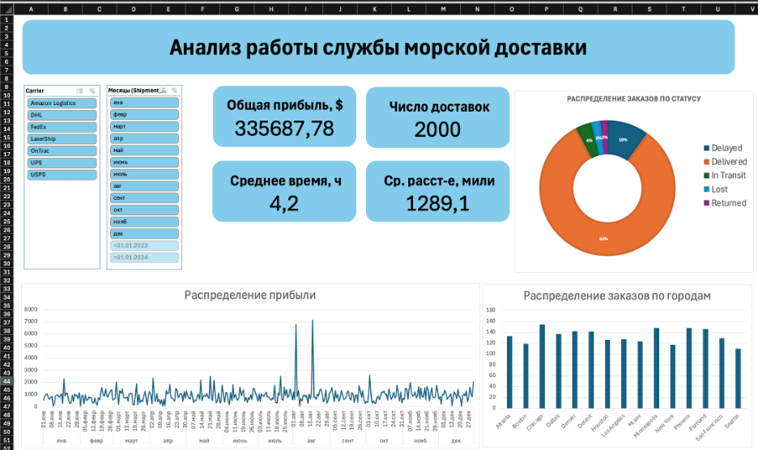

# Создание интерактивного дашборда в Excel

Цель работы — освоить полный цикл построения аналитического дашборда в Excel: от загрузки и подготовки данных до создания интерактивных визуализаций с фильтрацией через срезы. Результат — готовый инструмент для анализа логистических операций, позволяющий принимать управленческие решения на основе данных.

---

## Данные

Датасет взят с Kaggle: [US Logistics Performance Dataset](https://www.kaggle.com/datasets/shahriarkabir/us-logistics-performance-dataset).

Набор содержит информацию об отправке заказов морской доставкой, имитирующих реальные логистические операции в США за 2023 год. 2000 строк, 11 столбцов: ID клиента, склад отправки, город доставки, компания-перевозчик, дата отгрузки, дата доставки, вес, стоимость, расстояние и время доставки, статус заказа.

---

## Подготовка данных

Скачал датасет в формате CSV с Kaggle и импортировал в Excel. Загруженные данные сразу преобразовал в умную таблицу — это позволяет сводным таблицам автоматически захватывать новые строки при обновлении данных. Таблица уже была плоской и не требовала дополнительной трансформации.

---

## Построение дашборда

Перед тем как строить графики, набросал макет на отдельном листе — обозначил где будут KPI-карточки, где основные графики, где срезы. Это помогает не переделывать компоновку в конце.

Для каждого показателя создал отдельную сводную таблицу на вспомогательном листе:

- для KPI-карточек (общая прибыль, число доставок, среднее расстояние, среднее время) — простые сводные с одним агрегированным значением
- для линейного графика динамики прибыли — сводная с группировкой по месяцам
- для гистограммы по городам — сводная с группировкой по городу доставки, отсортированная по убыванию
- для круговой диаграммы — сводная по статусу заказа

По каждой сводной таблице построил диаграмму соответствующего типа. Затем скопировал диаграммы на отдельный лист дашборда и расставил согласно макету: KPI-карточки сверху по центру, графики занимают основную площадь.

Добавил два среза — по компании-перевозчику и по месяцу.

Подключил каждый срез ко всем сводным таблицам через "Подключения к отчётам", чтобы при выборе фильтра все графики и KPI обновлялись синхронно.

---

## Результаты

Получился рабочий интерактивный дашборд с KPI-карточками, тремя графиками и двумя срезами. С его помощью можно сравнивать показатели разных компаний-перевозчиков по месяцам: видно как меняется выручка, в каких городах сосредоточен основной спрос и какова доля проблемных заказов у каждого перевозчика.

